# Data Science Student

[Resume Download](./assets/resume/Octave%20Jagora%20Resume.pdf)

## Contacts
*LinkedIn :
 [Octave Jagora](www.linkedin.com/in/octave-jagora-474a08246)*

*Mail :
[octave.jagora@telecom-paris.fr](mailto:octave.jagora@telecom-paris.fr)*

## Table of Contents
- [Education](#education)
- [Work Experience](#work-experience)
- [Projects](#projects)
    - [Professional Projects](#professional-projects)
        - [Lead Tech Projects Manager](#lead-tech-projects-manager-2023-2024)
    - [Personal Projects](#personal-projects)
        - [CHIME : Molecule to Taxonomy ML Model](#chime--molecule-to-taxonomy-ml-model-2024)
        - [MRB : Molecular Graph Deep Learning](#mrb--molecular-graph-deep-learning-2024)
    - [Research Projects](#research-projects)
        - [Research Assistant](#research-assistant-2023)
    - [Academic Projects](#academic-projects)
        - [Crowdfunding Campaign Success Prediction](#crowdfunding-campaign-success-prediction-2024)
        - [FALL-E : Fall Detection System](#fall-e--fall-detection-system-2022)
        - [Phytoextraction : Using Plants to Clean Radioactive Soil](#phytoextraction--using-plants-to-clean-radioactive-soil-2018)

### Education
- **Master of Science in Engineering**, 
    Specialized in Data Science 

    > [Télécom Paris](https://www.telecom-paris.fr/en/home) (2022-2025) 
    

- **Master in Management and Digital Innovation** 

    > [Sciences Po Paris](https://www.sciencespo.fr/en/) (2024-2025)

### Work Experience
President (2023-2024) of the Junior Entreprise of Telecom Paris : [Telecom Etude](https://telecom-etude.fr/)
- Led a team of 32 people
- Supervised 23 technical projects with 15 clients of different sizes and sectors
- Managed a 100k€ budget
- Conserved our ISO 9001 certification
- Organized a Regional Congress with 400 participants

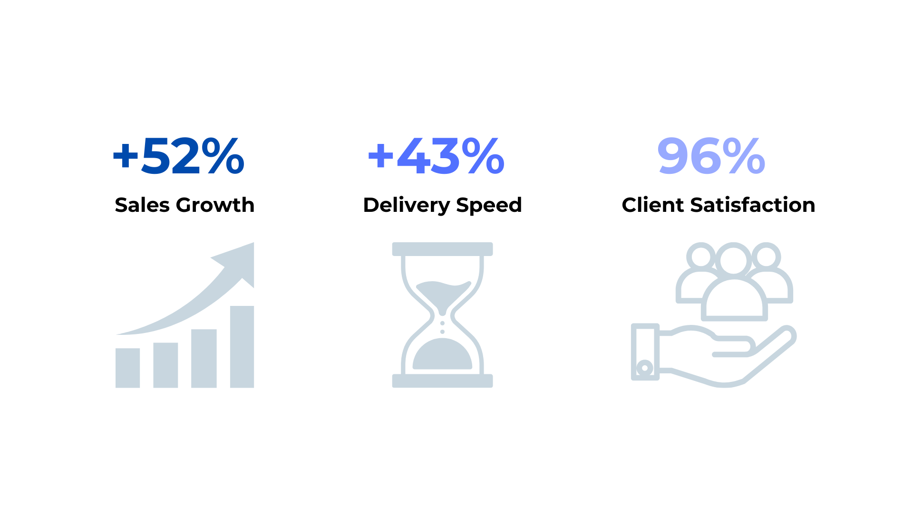

### Projects
#### Professional Projects
##### Lead Tech Projects Manager (2023-2024)
I was the Lead Tech Projects Manager for a private Company in the Plastic Recycling Industry. Our goal was to develop a suite of products to enable the company to tackle the challenges of recycling plastic waste logistics in foreign countries.

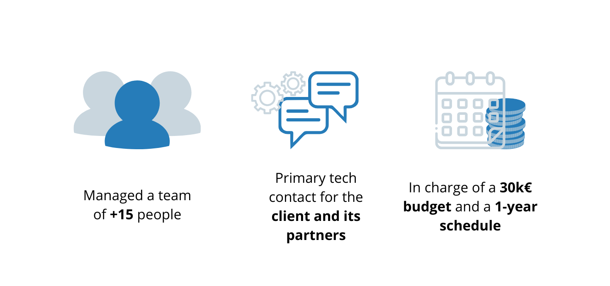

Our efforts were focused on the development of 4 main products:

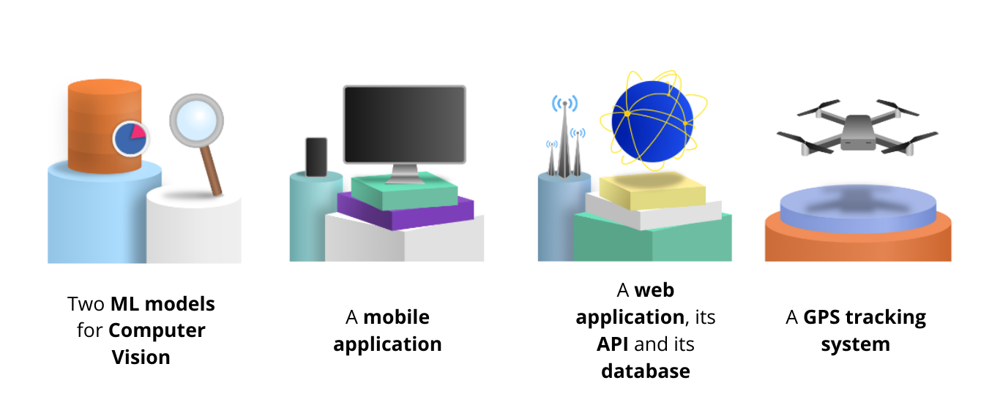

Today, the project is still ongoing, led by my successor, and the company is planning to launch the first product in the coming months.

#### Personal Projects
##### CHIME : Molecule to Taxonomy ML Model (2024)
CHIME is an application that allows chemists to predict the taxonomic group of a compound based on its SMILES representation.

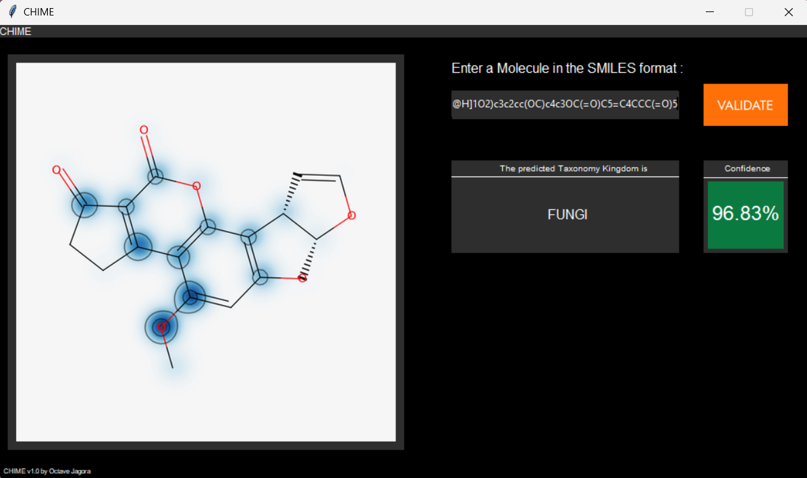

> This is a screenshot of the output of CHIME application when predicting the taxonomic group of Aflatoxin, a mycotoxin.

The application is based on a **SVM model** trained on *libsvm* with a dataset of 270k compounds.

The use of **SHAP values** allows to explain the model's predictions by highlighting the most important features in a similarity map of the compound.

This tool enable researchers to understand what features of a molecule a caracteristic of a taxonomic group, allowing them do better predict the structure of new compounds.

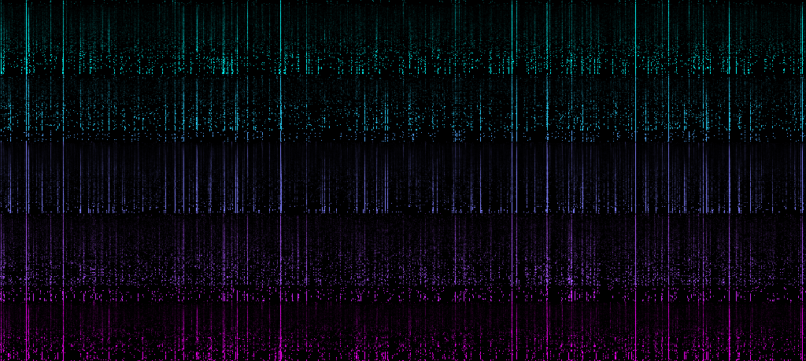

> This visualization was used during the early development of the model to understand the distribution of the features in the dataset.

#### MRB : Molecular Graph Deep Learning (2024)

> This is a graph of molecular similarity between different compounds using fingerprints and tanimoto similarity.

MRB is a work in progress personal research project that aims to benchmark the different representations of molecules in the context of a **similarity search**.

The project is based on different techniques such as:
- Graph Theory (Louvain Clustering)
- Molecular fingerprints (Morgan)
- Graph Kernel (Weisfeiler-Lehman)
- Graph Neural Networks (GNN)
- Gradient Boosting Trees (XGBoost)
- Support Vector Machines (SVM)

The goal is to understand the impact of the representation of a molecule on the prediction of activity of a compound.

#### Research Projects
##### Research Assistant (2023)
As an intern at the CNRS [BioCIS](https://www.pamir.fr/reseau/biocis/) lab (2023) I worked with a team of two professors and a PhD student on a project to develop a new method to quantify the novelty of a compound.

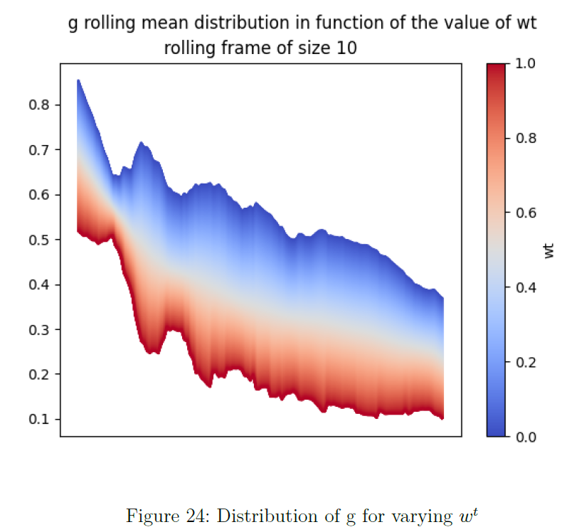

> This is an extract of the results of the sensibility analysis of the confidence function regarding a parameter.

I mainly worked on :
- Analysis of indices (Tanimoto and Modified Cosine) definition and implementation by different tools
- Analysis of fingerprints generation methods (such as Morgan Fingerprints)
- Sensibility analysis of a confidence function
- Proposal of a function to quantify novelty of a compound

The final paper by the team was published septemeber 10th 2025 in **Chemistry Europe** and is available [here](https://doi.org/10.1002/cmtd.202400088)

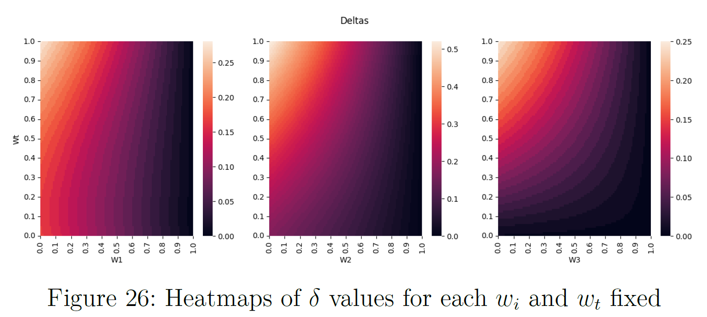

> This is antoher extract of the results of the sensibility analysis. The full work is available in the resources of the project.

#### Academic Projects
##### Crowdfunding Campaign Success Prediction (2024)
In this project with a team of 2 students, we aimed to predict the success of a crowdfunding campaign based on several features such as the category of the project, the goal, the duration etc.

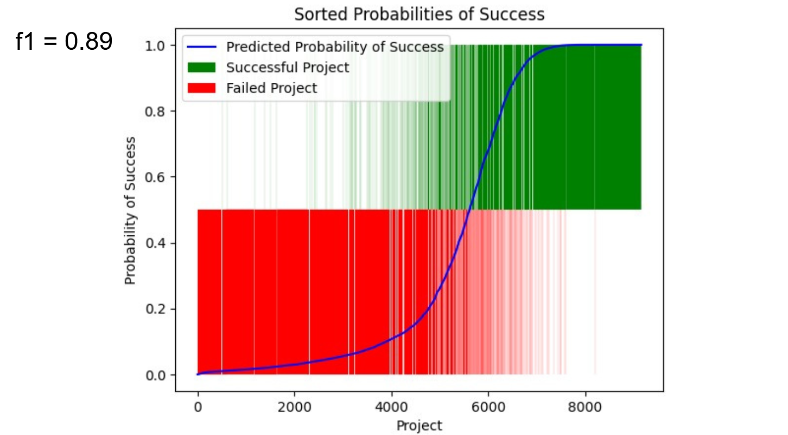

We used different models such as:
- **Logistic Regression**
- **Bayesian Regression**

We anylized more deeply the context of crowdfunding campaigns and the impact of the features on the success of the campaign.

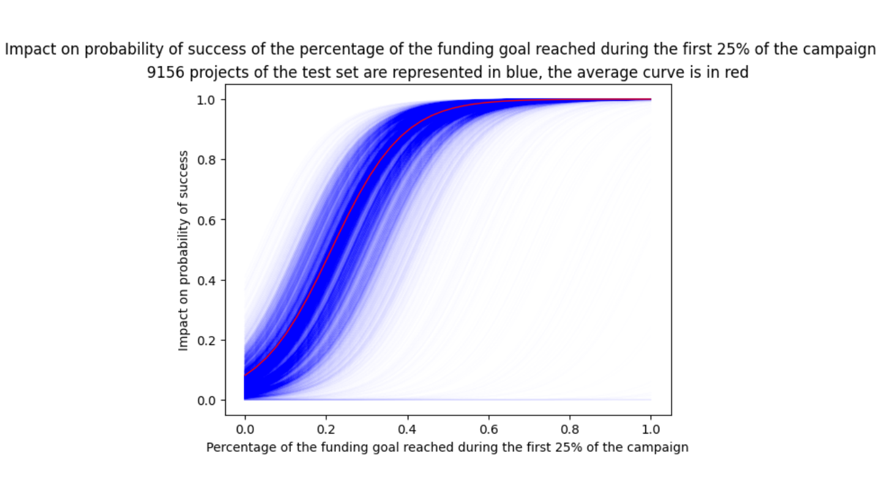

> For example, this graph illustrate the importance of raising money during the first quarter of the campaign. We can see that the probability of success is almost two to three times higher per percentage of the goal raised during the first quarter. **When a project raises 20% of its goal during the first quarter, the probability of success in the end is of 50%.**

##### FALL-E : Fall Detection System (2022)
I constructed a first prototype of a fall detection system based on a inertial measurement unit (IMU) and an analysis of the signal with metrics such as the Head Injury Criterion (HIC) and the Fall Index (FI).

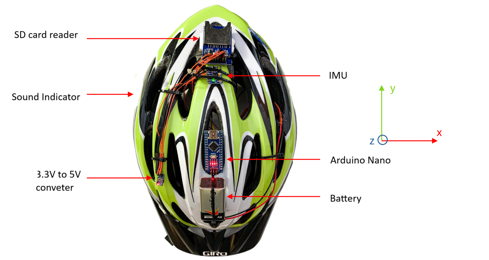

The system was able to correctly detect falls from a circuit motorbike online dataset and a home made cyclist databse.

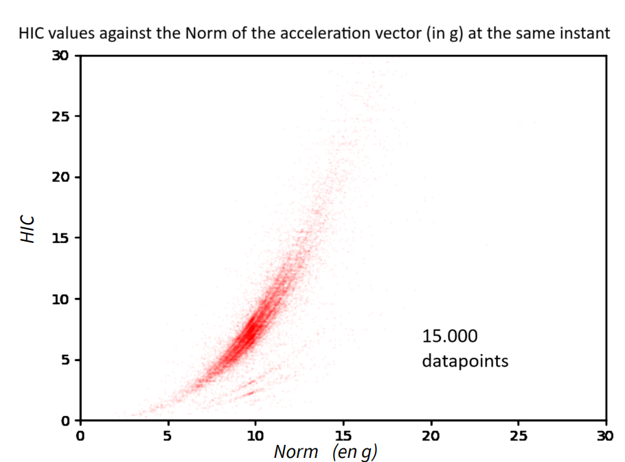

**This system could be miniaturized and integrated into a helmet to detect falls in real time and alert the emergency services in case of an accident.** 

The algorithm used enables to tailor the detection based on the mean of transportation : bike, scooter, ski etc.

##### Phytoextraction : Using Plants to Clean Radioactive Soil (2018)
As a High School student, I worked with 14 other students and three teachers on a project to clean radioactive soil with plants, after having met with Fukushima students.

We worked with the [CEA](https://www.cea.fr/) and the [IRSN](https://www.irsn.fr/) to grow cesium-133 contaminated plants and measure the amount of cesium absorbed by the plants using mass spectrometry.

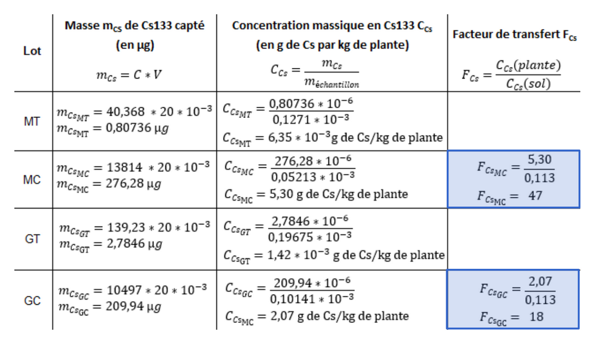

> This is a Table of the concentration of cesium in the plants after 3 weeks of growth. We calculated the *Transfer Factor* of cesium in the plants to measure the capcity of plants to absorb the radioactive element present in the soil and store it in their tissues.

With two other students, we presented the results of our research before three professional juries at the national CGénial competition and won the first prize.

We also presented our project during the International Radioprotection Congress in Dijon in 2018, as well as in Cambridge, UK, in 2019, during a scientific trip offered by SLB for our first prize.

