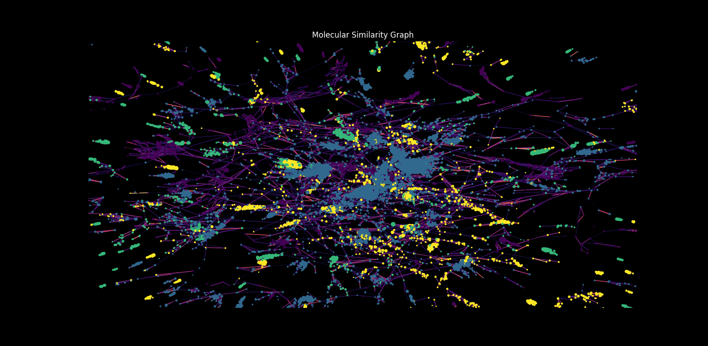

# Data Science and Management Student

## Table of Contents
- [Education](#education)
- [Work Experience](#work-experience)
- [Projects](#projects)
    - [Professional Projects](#professional-projects)
        - [Lead Tech Projects Manager](#lead-tech-projects-manager-2023-2024)
    - [Research Projects](#research-projects)
        - [Research Assistant](#research-assistant-2023)
    - [Personal Projects](#personal-projects)
        - [CHIME : Molecule to Taxonomy ML Model](#chime--molecule-to-taxonomy-ml-model-2024)
        - [MRB : Molecular Graph Deep Learning](#mrb--molecular-graph-deep-learning-2024)
    - [Academic Projects](#academic-projects)
        - [Crowdfunding Campaign Success Prediction](#crowdfunding-campaign-success-prediction-2024)
        - [FALL-E : Fall Detection System](#fall-e--fall-detection-system-2022)
        - [Phytoextraction : Using Plants to Clean Radioactive Soil](#phytoextraction--using-plants-to-clean-radioactive-soil-2018)

### Education
- **Master of Science in Engineering**, 
    Specialized in Data Science 

    > [Télécom Paris](https://www.telecom-paris.fr/en/home) (2022-2025) 
    

- **Management and Digital Innovation** 

    > [Sciences Po Paris](https://www.sciencespo.fr/en/) (2024-2025)

### Work Experience
President (2023-2024) of the Junior Entreprise of Telecom Paris : [Telecom Etude](https://telecom-etude.fr/)
- Led a team of 32 people
- Supervised 23 projects with 15 clients of different sizes and sectors
- Managed a 100k€ budget
- Conserved our ISO 9001 certification
- Organized a Regional Congress with 400 participants

### Projects
#### Professional Projects
##### Lead Tech Projects Manager (2023-2024)
I was the Lead Tech Projects Manager for a private Company.
My main responsibilities were:

- Managed a team of 10 people
- Primary tech contact for the client and its partners
- Supervised the development of four products :
    - A **mobile application**
    - A **web application**, its **API** and its **database**
    - Two **ML models**
    - A **GPS tracking system**
- In charge of a 30k€ budget and a 1-year deadline

#### Research Projects
##### Research Assistant (2023)
As an intern at the CNRS [BioCIS](https://www.pamir.fr/reseau/biocis/) lab (2023) I worked with a team of two professors and a PhD student on a project to develop a new method to quantify the novelty of a compound.

I mainly worked on :
- Analysis of indices (Tanimoto and Modified Cosine) definition and implementation by different tools
- Analysis of fingerprints generation methods (such as Morgan Fingerprints)
- Sensibility analysis of a confidence function
- Proposal of a function to quantify novelty of a compound

#### Personal Projects
##### CHIME : Molecule to Taxonomy ML Model(2024)
CHIME is an application that allows chemists to predict the taxonomic group of a compound based on its SMILES representation.

The application is based on a **SVM model** trained on *libsvm* with a dataset of 270k compounds.

The use of **SHAP values** allows to explain the model's predictions by highlighting the most important features in a similarity map of the compound.

#### MRB : Molecular Graph Deep Learning  (2024)

MRB is a work in progress personal research project that aims to benchmark the different representations of molecules in the context of a **similarity search**.

The project is based on different techniques such as:
- Graph Theory (Louvain Clustering)
- Molecular fingerprints (Morgan)
- Graph Kernel (Weisfeiler-Lehman)
- Graph Neural Networks (GNN)
- Gradient Boosting Trees (XGBoost)
- Support Vector Machines (SVM)

#### Academic Projects
##### Crowdfunding Campaign Success Prediction (2024)
In this project with a team of 2 students, we aimed to predict the success of a crowdfunding campaign based on several features such as the category of the project, the goal, the duration etc.

We used different models such as:
- **Logistic Regression**
- **Bayesian Regression**

We anylized more deeply the context of crowdfunding campaigns and the impact of the features on the success of the campaign.

##### FALL-E : Fall Detection System (2022)
I constructed a first prototype of a fall detection system based on a inertial measurement unit (IMU) and an analysis of the signal with metrics such as the Head Injury Criterion (HIC) and the Fall Index (FI).

The system was able to correctly detect falls from a circuit motorbike online dataset and a home made cyclist databse.

##### Phytoextraction : Using Plants to Clean Radioactive Soil (2018)
As a High School student, I worked with 14 other students and three teachers on a project to clean radioactive soil with plants, after having met with Fukushima students.

We worked with the [CEA](https://www.cea.fr/) and the [IRSN](https://www.irsn.fr/) to grow cesium-135 contaminated plants and measure the amount of cesium absorbed by the plants using mass spectrometry.

With two other students, we presented the results of our research before three professional juries at the national CGénial competition and won the first prize.

We also presented our project during the International Radioprotection Congress in Dijon in 2018, as well as in Cambridge, UK, in 2019, during a scientific trip offered by SLB for our first prize.

